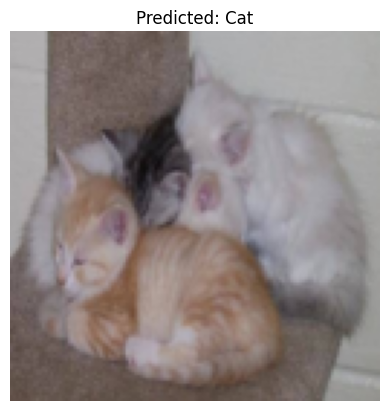
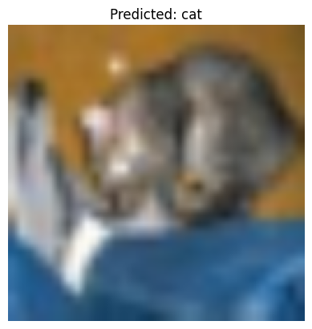
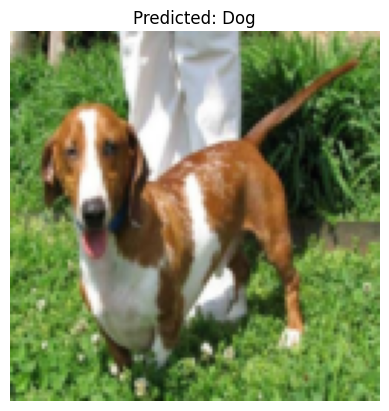
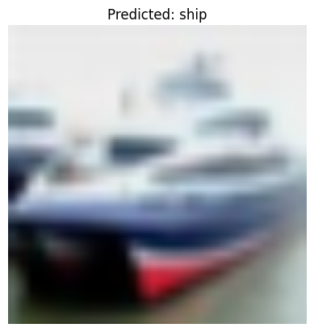
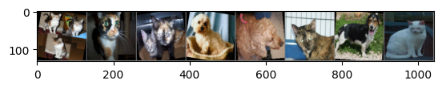
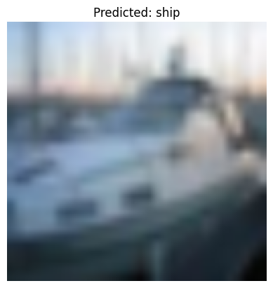
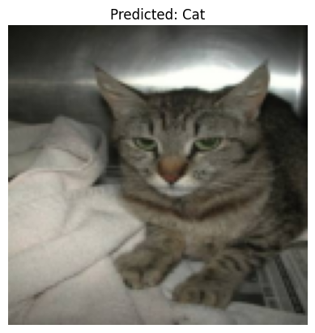

# 🐱🐶 Cat vs Dog Image Classification

A deep learning project implementing image classification using ResNet18 with transfer learning to distinguish between cats and dogs, plus multi-class classification on CIFAR-10 dataset.

## 🎯 Features

- **Binary Classification**: High-accuracy cat vs dog classification (98.24% validation accuracy)
- **Multi-class Classification**: CIFAR-10 10-class object recognition (90.89% test accuracy)
- **Transfer Learning**: Leverages pre-trained ResNet18 models for efficient training
- **Class Imbalance Handling**: Advanced techniques for handling unbalanced datasets
- **Data Augmentation**: Image transformations to improve model robustness

## 📊 Results

### Cat vs Dog Classification


- **Model**: ResNet18 (Transfer Learning)
- **Dataset**: 25,000 images (20K train + 5K validation)
- **Validation Accuracy**: 98.24%
- **Training Time**: ~30 minutes on RTX 3060

### CIFAR-10 Classification


- **Model**: ResNet18 adapted for 10 classes
- **Dataset**: 60,000 CIFAR-10 images
- **Test Accuracy**: 90.89%
- **Classes**: airplane, automobile, bird, cat, deer, dog, frog, horse, ship, truck

## 🚀 Quick Start

### Prerequisites
```bash
pip install torch torchvision matplotlib pandas numpy pillow
```

### Running the Cat vs Dog Classifier
```python
# Clone and navigate to the repository
git clone <your-repo-url>
cd cat-vs-dog-classifier

# Run the Jupyter notebook
jupyter notebook Dogvscat_classifier.ipynb
```

### Running the CIFAR-10 Classifier
```python
# Run the CIFAR-10 classification notebook
jupyter notebook cifar10_classifier.ipynb
```

## 📁 Project Structure

```
├── Dogvscat_classifier.ipynb          # Main cat vs dog classification notebook
├── cifar10_classifier.ipynb           # CIFAR-10 multi-class classification
├── datasets/                          # Training and validation data
│   ├── train/                         # Training images
│   │   ├── cat/                       # Cat images (10,000)
│   │   └── dog/                       # Dog images (10,000)
│   ├── val/                           # Validation images
│   │   ├── cat/                       # Cat validation (2,500)
│   │   └── dog/                       # Dog validation (2,500)
│   └── test/                          # Test images (500)
├── Dogvscat_classifier_files/         # Generated plots and visualizations
├── cifar10_classifier_files/          # CIFAR-10 visualizations
└── README.md                          # This file
```

## 🛠️ Technical Details

### Model Architecture
- **Base Model**: ResNet18 pre-trained on ImageNet
- **Transfer Learning**: Frozen convolutional layers, fine-tuned FC layer
- **Input Size**: 224×224 (Cat/Dog) | 128×128 (CIFAR-10)
- **Output**: 2 classes (Cat/Dog) | 10 classes (CIFAR-10)

### Training Configuration
- **Optimizer**: Adam (lr=0.001)
- **Loss Function**: CrossEntropyLoss
- **Batch Size**: 32
- **Data Augmentation**: Random horizontal flip, rotation
- **Epochs**: 5-10

### Data Preprocessing
```python
transform = transforms.Compose([
    transforms.Resize((224, 224)),
    transforms.RandomHorizontalFlip(),
    transforms.ToTensor(),
    transforms.Normalize([0.5], [0.5])
])
```

## 📈 Performance Analysis

### Cat vs Dog Classification Results


**Strengths:**
- Excellent performance on clear, well-lit images
- Robust feature extraction for typical cat/dog characteristics
- Fast inference with transfer learning

**Challenges:**
- Difficulty with occluded or partial images
- Performance drops with poor lighting conditions
- Struggles with unusual poses or angles

### CIFAR-10 Classification Results


**Class Performance:**
- Strong performance across all 10 classes
- Effective handling of small 32×32 images
- Good generalization despite limited training epochs

## 🔧 Advanced Features

### Class Imbalance Handling
The project implements two approaches for handling imbalanced datasets:

1. **Weighted Sampling**: Oversampling minority classes during training
2. **Class Weighting**: Assigning higher loss weights to underrepresented classes

### Model Comparison
Comparison of different architectures:
- **ResNet18**: Best balance of accuracy and speed
- **ResNet50/101**: Higher accuracy but slower training
- **AlexNet**: Faster but lower accuracy
- **GoogleNet**: Good accuracy but complex architecture

## 📊 Visualization Examples

### Training Progress


### Sample Predictions


## 🎯 Use Cases

- **Pet Recognition Apps**: Automatically classify pet photos
- **Content Moderation**: Filter and categorize animal images
- **Educational Tools**: Demonstrate transfer learning concepts
- **Computer Vision Research**: Baseline for image classification tasks

## 🔮 Future Improvements

- [ ] Implement data augmentation with more sophisticated techniques
- [ ] Add support for more animal classes
- [ ] Experiment with newer architectures (EfficientNet, Vision Transformers)
- [ ] Deploy as web application with real-time prediction
- [ ] Add confidence scoring and uncertainty estimation

## 📋 Requirements

```
torch>=1.9.0
torchvision>=0.10.0
matplotlib>=3.3.0
pandas>=1.3.0
numpy>=1.21.0
Pillow>=8.3.0
jupyter>=1.0.0
```

## 🤝 Contributing

1. Fork the repository
2. Create a feature branch (`git checkout -b feature/amazing-feature`)
3. Commit your changes (`git commit -m 'Add amazing feature'`)
4. Push to the branch (`git push origin feature/amazing-feature`)
5. Open a Pull Request

## 📄 License

This project is licensed under the MIT License - see the [LICENSE](LICENSE) file for details.

## 🙏 Acknowledgments

- Pre-trained ResNet18 models from torchvision
- CIFAR-10 dataset from the Canadian Institute for Advanced Research
- PyTorch team for the excellent deep learning framework

---

<div align="center">
  
</div>

<div align="center">
  <strong>Built with ❤️ using PyTorch and ResNet18</strong>
</div>
